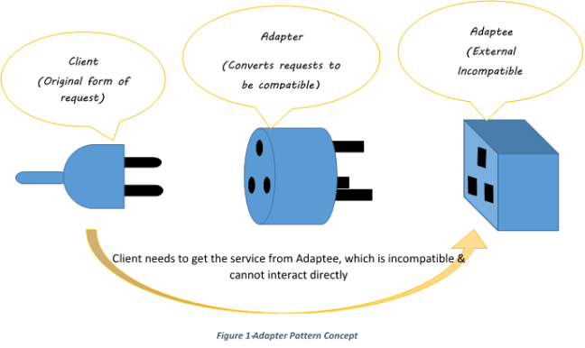

# Adapter Pattern

The `Adapter` pattern allows classes with incompatible interfaces to work together by wrapping an existing object with a new interface the client already understands.

In short: the client depends on a clean target interface, while the adapter translates requests to a legacy, third-party, or differently shaped service.

## Core Idea

- You define a target interface that the client expects
- You keep the existing service/class unchanged as the adaptee
- The adapter sits in between and translates method names, data shape, or calling conventions
- The client uses the adapter as if it were the target interface

## When To Use It

- When you need to integrate legacy code without rewriting it
- When a third-party service exposes an interface that does not match your app design
- When you want to normalize multiple providers behind one client-facing contract

## 1) Payment Adapter (`payment_adapter.ts`)

- Target: `PaymentProcessor`
- Adaptees:
  - `StripeGateway`
  - `LegacyPaymentGateway`
- Adapters:
  - `StripeAdapter`
  - `LegacyPaymentAdapter`
- Client: `CheckoutService`

Run:

- `npm run example:adapter-payment`

## 2) Logger Adapter (`logger_adapter.ts`)

- Target: `AppLogger`
- Adaptees:
  - `ConsoleLoggerService`
  - `WinstonLikeLogger`
- Adapters:
  - `ConsoleLoggerAdapter`
  - `WinstonLoggerAdapter`
- Client: `UserService`

Run:

- `npm run example:adapter-logger`

## 3) XML to JSON Adapter (`xml_json_adapter.ts`)

- Target: `JsonDataProvider`
- Adaptee: `XmlService`
- Adapter: `XmlToJsonAdapter`
- Client: `App`

Run:

- `npm run example:adapter-xml-json`

## Workflow

1. The client depends on a target interface
2. The adapter receives or wraps an existing incompatible service
3. The adapter translates calls or data into the format the client expects
4. The client works without knowing the adaptee details

## Diagram

## Advantages

- Reuses existing classes without modifying them
- Reduces coupling between client code and external/legacy APIs
- Makes migration to new providers or formats easier
- Centralizes translation logic in one place

## Tradeoffs

- Adds an extra abstraction layer
- Too many adapters can make the structure noisy if overused
- Poor adapter design can hide mismatches instead of clarifying them

## Extension Note

To add a new Adapter example, usually you only need to:

1. Define the target interface expected by the client
2. Keep the existing incompatible service as the adaptee
3. Create an adapter that translates between both sides
4. Inject the adapter into the client instead of using the adaptee directly
